# SIMADA e-Tendering System

Sistem Informasi Manajemen Pengadaan Daerah (SIMADA) berbasis **e-Tendering** yang dibangun menggunakan **Laravel** untuk backend API dan **React + TailwindCSS** untuk frontend dashboard.

Project ini dibuat sebagai prototype sistem pengadaan elektronik pemerintah daerah yang mendukung proses tender mulai dari pengelolaan paket pengadaan hingga penetapan pemenang tender.

---

# Project Objectives

The SIMADA e-Tendering System aims to:

- Digitalize procurement processes
- Improve procurement transparency
- Simplify vendor bidding process
- Provide centralized tender management
- Support procurement reporting & analytics

---

# Features

## Authentication & Authorization

- Login multi-role
- Role-based access control
- Protected frontend routes
- Session/token authentication

### Halaman Login


## Procurement Management

- Manajemen Paket Pengadaan
- Manajemen Dokumen Tender
- Status Paket (`open` / `close`)

### Halaman Data Pengadaan (Admin/Pokja)

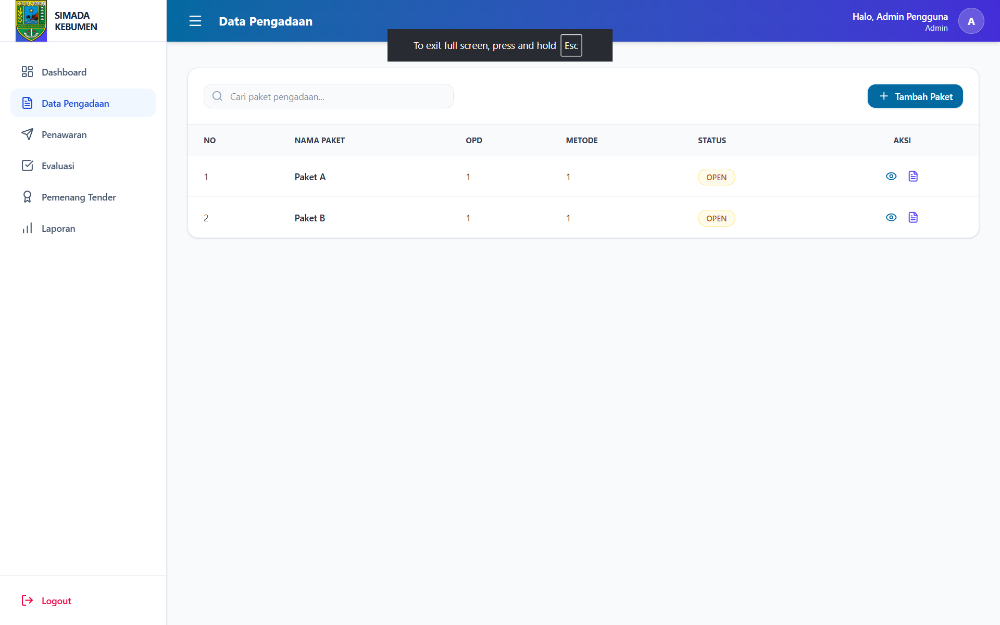

### Tambah Paket Pengadaan

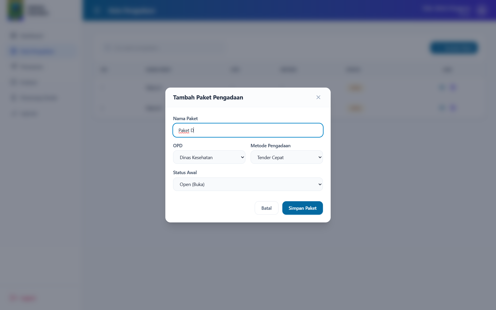

### Detail Paket Pengadaan

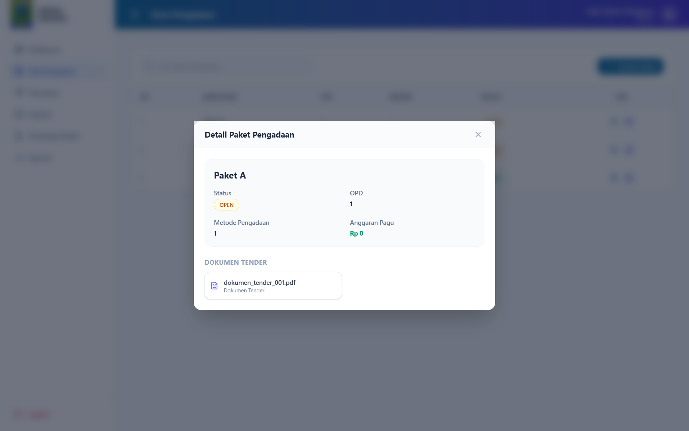

### Dokumen Tender

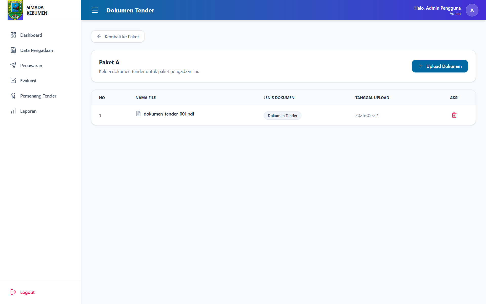

### Upload Dokumen Tender

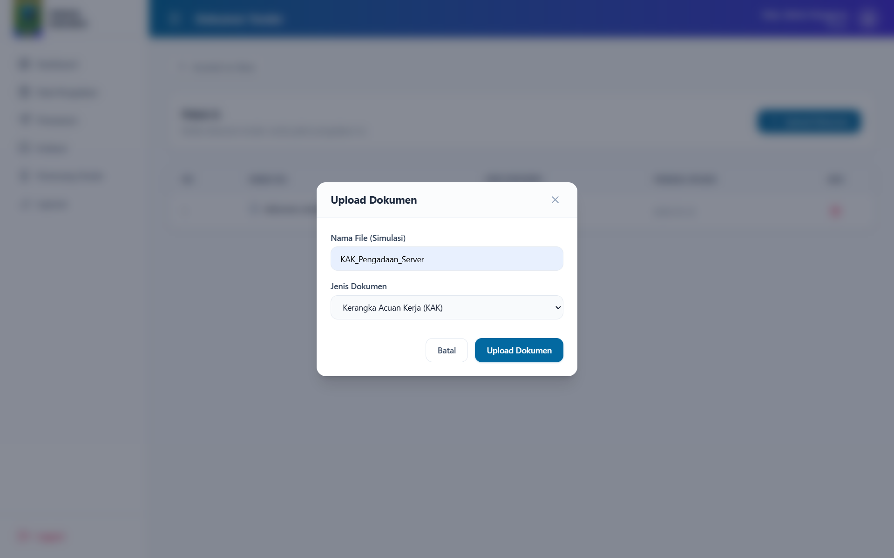

## Vendor Bidding

- Penyedia dapat melihat tender terbuka
- Submit penawaran tender
- Riwayat penawaran penyedia

### Halaman Penawaran Vendor

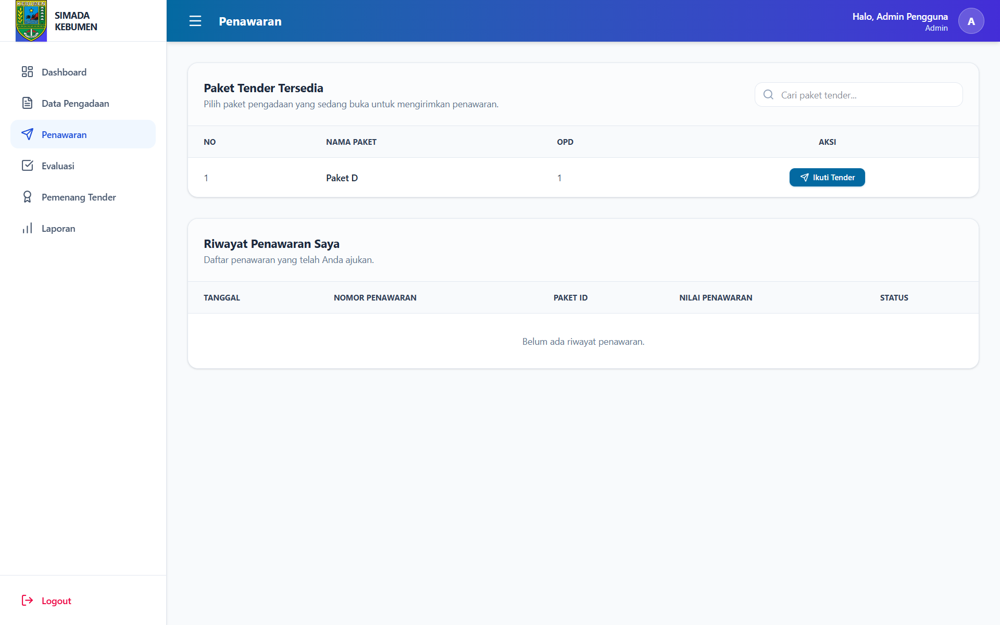
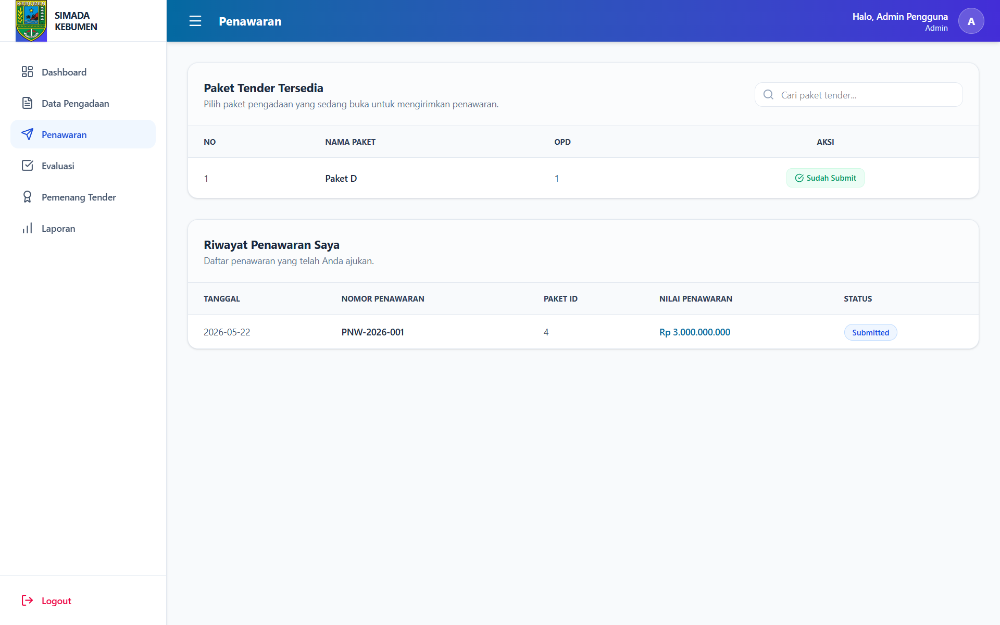

### Detail dan Submit Penawaran

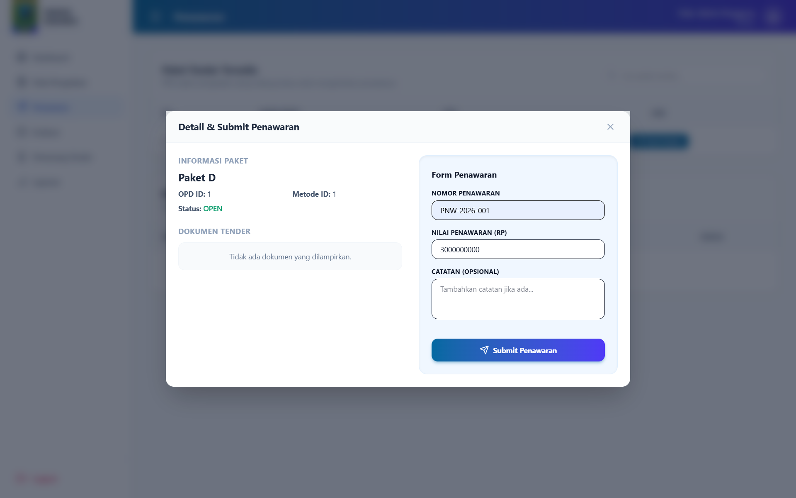

## Bid Evaluation

- Evaluasi penawaran
- Penilaian teknis & harga
- Status evaluasi:
  - Evaluasi
  - Lolos
  - Tidak Lolos

### Halaman Evaluasi Penawaran

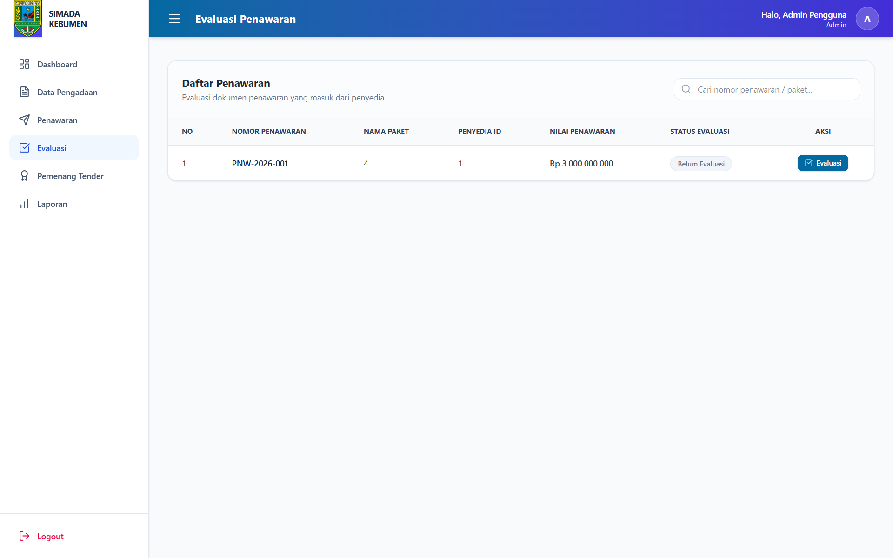
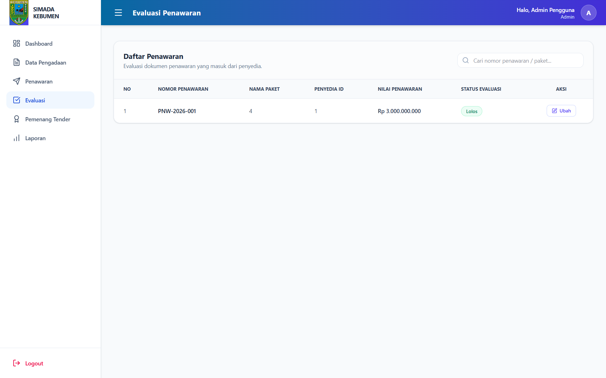

### Form/Modal Input Evaluasi

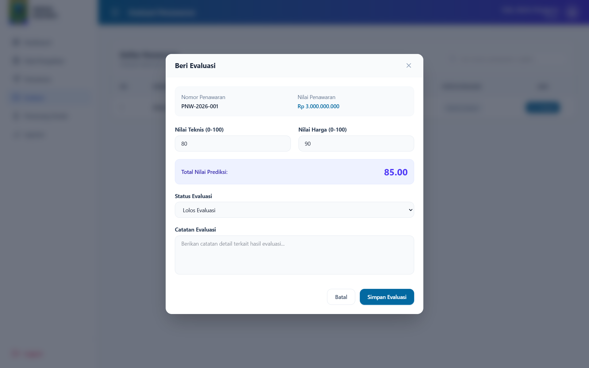

## Winner Selection

- Penetapan pemenang tender
- Otomatis menutup paket pengadaan setelah pemenang ditentukan

### Halaman Penetapan Pemenang Tender

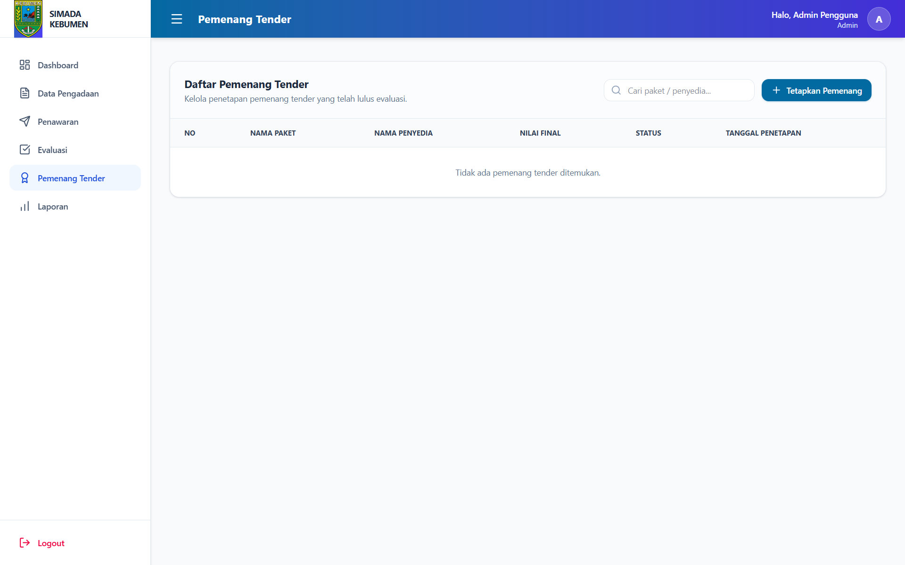


### Form/Modal Tetapkan Pemenang

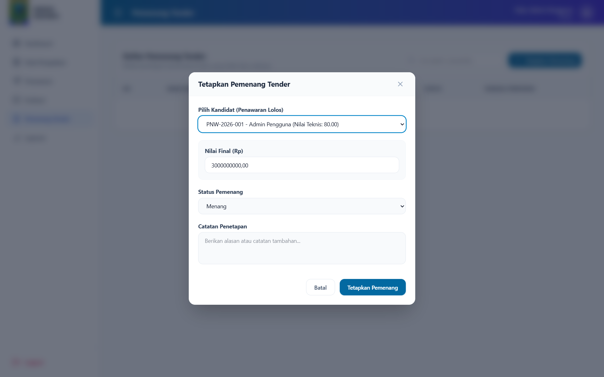

## Dashboard & Reporting

- Dashboard analytics berdasarkan role
- Laporan:
  - Paket Pengadaan
  - Penawaran
  - Evaluasi
  - Pemenang Tender
- Export PDF
- Export Excel
- Grafik analytics

### Dashboard Analytics (Admin)

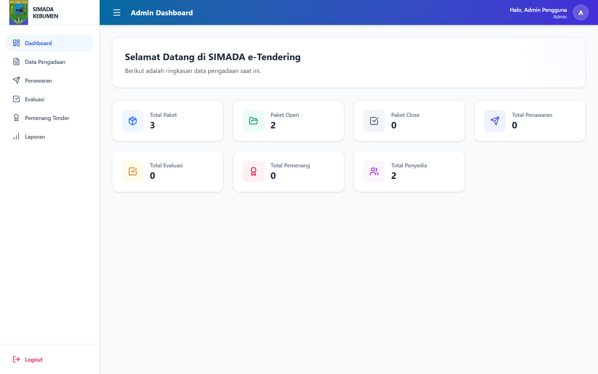

### Halaman Laporan & Analytics

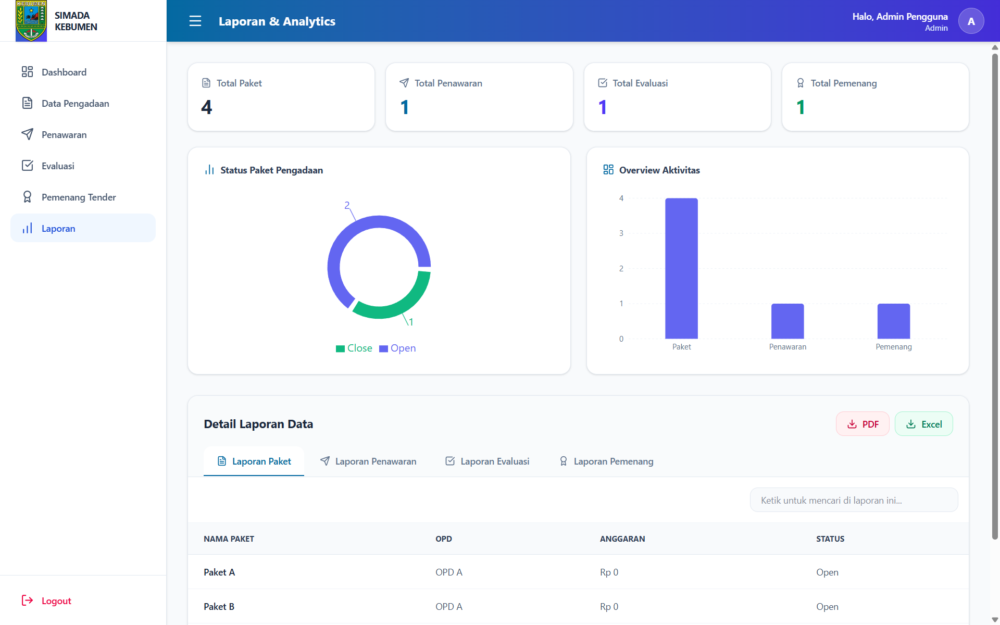

---

# Technology Stack

## Backend

- Laravel
- MySQL
- REST API

## Frontend

- React
- Vite
- TailwindCSS
- Axios
- React Router DOM
- Recharts
- jsPDF
- xlsx

---

# System Requirements

## Backend Requirements

| Software | Version |
| -------- | ------- |
| PHP      | >= 8.2  |
| Composer | >= 2.0  |
| Laravel  | >= 11   |
| MySQL    | >= 8.0  |

## Frontend Requirements

| Software | Version |
| -------- | ------- |
| Node.js  | >= 20   |
| npm      | >= 10   |
| React    | Latest  |
| Vite     | Latest  |

---

# System Architecture

┌─────────────────────────────┐
│ Frontend │
│ React + Vite + TailwindCSS │
│ Role-based Dashboard │
└──────────────┬──────────────┘
│ REST API
▼
┌─────────────────────────────┐
│ Backend │
│ Laravel │
│ Authentication & Business │
│ Logic │
└──────────────┬──────────────┘
│
▼
┌─────────────────────────────┐
│ Database │
│ MySQL │
│ Procurement & Tender Data │
└─────────────────────────────┘

---

# System Roles

| Role       | Access                         |
| ---------- | ------------------------------ |
| Admin      | Full system access             |
| Pokja      | Tender management & evaluation |
| Penyedia   | Submit penawaran               |
| Masyarakat | Public information access      |

---

# Role Permission Matrix

| Feature                    | Admin | Pokja | Penyedia | Public |
| -------------------------- | ----- | ----- | -------- | ------ |
| Login System               | ✅    | ✅    | ✅       | ❌     |
| Manage Procurement Package | ✅    | ✅    | ❌       | ❌     |
| Upload Tender Document     | ✅    | ✅    | ❌       | ❌     |
| Submit Bid                 | ❌    | ❌    | ✅       | ❌     |
| Evaluate Bid               | ✅    | ✅    | ❌       | ❌     |
| Select Winner              | ✅    | ✅    | ❌       | ❌     |
| View Public Information    | ✅    | ✅    | ✅       | ✅     |
| Generate Report            | ✅    | ✅    | ❌       | ❌     |

---

# Main Workflow

```text
Paket Pengadaan
→ Dokumen Tender
→ Penawaran Penyedia
→ Evaluasi Penawaran
→ Penetapan Pemenang
→ Laporan & Dashboard
```

---

# Authentication Flow

User Login
↓
Laravel Authentication
↓
Token Generation
↓
Role Validation
↓
Protected Dashboard Access

---

# Database Documentation

| Entity          | Description                    |
| --------------- | ------------------------------ |
| users           | Menyimpan data pengguna sistem |
| paket_pengadaan | Data paket tender/pengadaan    |
| dokumen_tender  | Dokumen tender yang diupload   |
| penawaran       | Data penawaran vendor          |
| evaluasi        | Hasil evaluasi tender          |
| pemenang_tender | Data pemenang tender           |

---

# Backend Installation

## 1. Clone Repository

```bash
git clone <repository-url>
```

## 2. Masuk ke Folder Backend

```bash
cd backend
```

## 3. Install Dependency

```bash
composer install
```

## 4. Copy Environment File

```bash
cp .env.example .env
```

## 5. Generate Application Key

```bash
php artisan key:generate
```

## 6. Configure Database

Edit file `.env`

```env
DB_DATABASE=simada_etendering
DB_USERNAME=root
DB_PASSWORD=
```

## 7. Run Migration & Seeder

```bash
php artisan migrate:fresh --seed
```

## 8. Run Backend Server

```bash
php artisan serve
```

Backend URL:

```text
http://127.0.0.1:8000
```

---

# Frontend Installation

## 1. Masuk ke Folder Frontend

```bash
cd frontend
```

## 2. Install Dependency

```bash
npm install
```

## 3. Run Frontend

```bash
npm run dev
```

Frontend URL:

```text
http://localhost:5173
```

---

# Seeder Accounts

| Role       | Email                  | Password |
| ---------- | ---------------------- | -------- |
| Admin      | admin@example.com      | password |
| Pokja      | pokja@example.com      | password |
| Penyedia   | penyedia1@example.com  | password |
| Masyarakat | masyarakat@example.com | password |

---

# API Documentation

## Authentication

| Method | Endpoint    |
| ------ | ----------- |
| POST   | /api/login  |
| POST   | /api/logout |

---

# API Documentation

## API Base URL

http://127.0.0.1:8000/api

## API Response Example

{
"success": true,
"message": "Login successful",
"token": "access_token_here"
}

---

## Paket Pengadaan

| Method | Endpoint                        |
| ------ | ------------------------------- |
| GET    | /api/paket-pengadaan            |
| POST   | /api/admin/paket-pengadaan      |
| PUT    | /api/admin/paket-pengadaan/{id} |
| DELETE | /api/admin/paket-pengadaan/{id} |

---

## Dokumen Tender

| Method | Endpoint                                |
| ------ | --------------------------------------- |
| GET    | /api/paket-pengadaan/{id}/dokumen       |
| POST   | /api/admin/paket-pengadaan/{id}/dokumen |
| DELETE | /api/admin/dokumen/{id}                 |

---

## Penawaran

| Method | Endpoint                                   |
| ------ | ------------------------------------------ |
| GET    | /api/penawaran                             |
| POST   | /api/vendor/paket-pengadaan/{id}/penawaran |

---

## Evaluasi

| Method | Endpoint                 |
| ------ | ------------------------ |
| GET    | /api/evaluasi            |
| POST   | /api/admin/evaluasi      |
| PUT    | /api/admin/evaluasi/{id} |

---

## Pemenang Tender

| Method | Endpoint                   |
| ------ | -------------------------- |
| GET    | /api/pemenang-tender       |
| POST   | /api/admin/pemenang-tender |

---

## Reporting

| Method | Endpoint               |
| ------ | ---------------------- |
| GET    | /api/laporan/paket     |
| GET    | /api/laporan/penawaran |
| GET    | /api/laporan/evaluasi  |
| GET    | /api/laporan/pemenang  |

---

# Frontend Structure

```text
src/
├── api/
├── assets/
├── components/
├── context/
├── layouts/
├── pages/
│   ├── admin/
│   ├── auth/
│   ├── pokja/
│   ├── public/
│   └── vendor/
├── routes/
├── utils/
├── App.jsx
└── main.jsx
```

---

# Project Structure

```text
backend/
frontend/
```

---

# Security Documentation

## Security Features

The system implements several security mechanisms:

- Authentication & Authorization
- Role-based Access Control (RBAC)
- Protected API Routes
- Token-based Session Authentication
- Form Validation
- Secure File Upload Validation
- Access Restriction by Role
- Input Validation & Sanitization

## Authentication Security

The authentication system uses:

- Protected login endpoint
- Token/session validation
- Middleware route protection
- Role validation before dashboard access

## File Upload Security

Uploaded tender documents are validated using:

- File type validation
- File size limitation
- Protected upload endpoint

---

# Reporting & Analytics Documentation

The reporting and analytics module provides monitoring and reporting features for procurement activities within the SIMADA e-Tendering System.

## Available Reports

- Procurement Package Report
- Vendor Bid Report
- Bid Evaluation Report
- Tender Winner Report

## Analytics Features

The dashboard analytics feature provides visualization and monitoring for procurement activities such as:

- Total procurement packages
- Total vendors
- Total submitted bids
- Total completed evaluations
- Tender winner statistics

## Export Features

The system supports report export functionality in multiple formats:

- PDF Export
- Excel Export

## Visualization

Analytics data is visualized using charts and dashboard widgets to improve readability and monitoring efficiency.

---

# Final Checklist

- [x] Authentication
- [x] Role-based Access
- [x] Paket Pengadaan Management
- [x] Dokumen Tender Management
- [x] Penawaran Penyedia
- [x] Evaluasi Penawaran
- [x] Penetapan Pemenang
- [x] Dashboard Analytics
- [x] Reporting
- [x] Export PDF
- [x] Export Excel
- [x] Responsive UI

---

# Authors

Kelompok 1

- Egbert Felica Wibianto
- Mohammad Faalih
- Nur Alika Pandoyo Putri
- Yurfa Apridelia

SIMADA e-Tendering System  
Developed for academic/project purposes.
